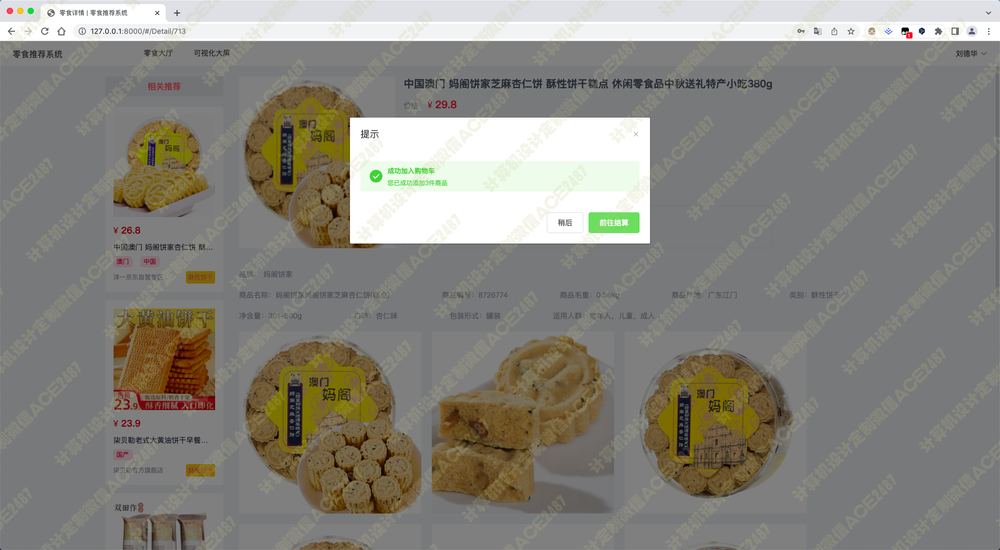
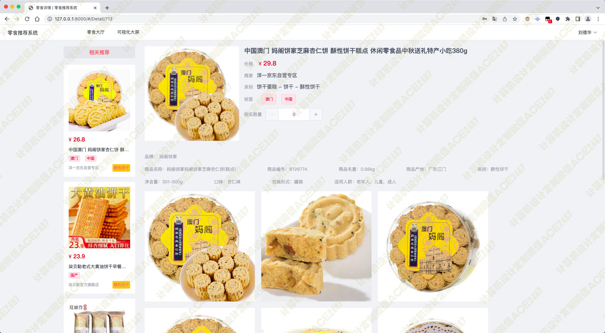

# 024 基于协同过滤的零食推荐系统-设计展示

> **代码有偿获取 可接受定制 微信联系方式: csbysj2020 或 ACE2487，备注(BS)**

> 

> 

## 介绍

1. 协同过滤算法：协同过滤是推荐系统中比较常用的算法之一，其核心思想是寻找用户之间的相似性，通过发现用户之间的共性，向用户推荐可能喜欢的商品或服务。
2. Python Django Vue：Django 是一个基于 Python 的 Web 开发框架，Vue 则是一个非常流行的前端框架，两者可以很好地配合使用，实现一个功能完备的 Web 应用程序。
3. Scrapy：Scrapy 是一个强大的 Python 网络爬虫框架，可以用来抓取京东零食等网站上的数据，并将其存入数据库中。
4. 零食检索和详情：在应用程序中集成一些搜索功能，可以让用户更快速地找到自己感兴趣的产品，同时也需要制作一个详细的零食详情页面供用户查看。
5. 加入购物车和结算购买：这是一个典型的电商平台功能，需要实现添加商品到购物车、修改购物车数量、删除购物车商品等功能，并且需要制作一个购物车页面供用户结算购买。
6. 历史订单和个人中心：在用户登录后，可以展示其历史订单信息，提高用户的购买体验。同时还需要一个个人中心页面，让用户可以修改个人信息、查看自己的购物车和订单等。
7. 后台管理：这是一个管理员使用的页面，可以管理零食商品数据、订单信息和用户数据等。

这个推荐系统的核心是协同过滤算法，其具体实现包括两个阶段，分别是对用户历史行为数据的处理和对用户相似性的计算。

在第一阶段中，我们需要将用户在零食网站上的历史行为数据进行处理，包括用户浏览、点赞、收藏、购买等操作。通过这些操作的记录，我们可以建立一个“用户-零食”矩阵，即每一行代表一个用户，每一列代表一种零食，在矩阵中填充的值代表了用户对该零食的喜爱程度或者关注程度，比如购买次数或者收藏次数等等。

在第二阶段中，我们需要利用用户-零食矩阵来计算用户之间的相似度，通常采用的方法是计算余弦相似度或者皮尔逊相关系数等相似度度量方法。计算出各个用户之间的相似度后，就可以利用加权平均数等方法为目标用户推荐一些他/她可能感兴趣的零食。

当然，为了提高推荐效果，我们还可以采用一些优化手段，比如引入隐式反馈信息，加入时间因素等等。

最后，需要实现一个完整的零食推荐系统，还需要技术支持，比如使用 Python 爬虫技术抓取京东零食数据，使用 Django 框架搭建 Web 应用程序，使用 Vue 前端框架进行页面展示等等。

## 技术栈

python django vue 协同过滤算法 scrapy 爬虫抓取京东零食 零食检索 零食详情 加入购物车 结算购买 查看历史订单 个人中心 基于用户历史浏览来推荐零食 后台管理零食商品数据

## 视频

> **点击查看 \>\>\> [https://www.bilibili.com/video/BV1YM4y167yq/](https://www.bilibili.com/video/BV1YM4y167yq/)**

## 截图

